# APIM ❤️ A2A Agents

## [A2A Agents from REST API lab](demo-a2a.ipynb)

Transform existing REST APIs into **A2A (Agent-to-Agent) protocol** servers using Azure API Management — with zero application code changes.

## What is A2A?

The [Agent-to-Agent (A2A) protocol](https://google.github.io/A2A/) is an open standard that enables AI agents to communicate with each other. Every A2A agent exposes:

| Endpoint | Purpose |
|----------|---------|
| `GET /.well-known/agent.json` | **Agent Card** — describes the agent's name, skills, and capabilities |
| `POST /` | **JSON-RPC 2.0** — `message/send` to invoke the agent |

This lab shows how APIM policies can implement the entire A2A protocol layer in front of existing REST APIs.

## Architecture

> 📐 Open the [architecture diagram](a2a-architecture.drawio) in VS Code (with the Draw.io extension) for a detailed interactive view.

```mermaid
graph TB
    subgraph APIM["Azure API Management"]
        subgraph Title["Title Agent"]
            TA2A["A2A Server<br/>├ agent.json<br/>└ message/send"]
            TAPI["REST API<br/>POST /generate-title"]
        end
        subgraph Outline["Outline Agent"]
            OA2A["A2A Server<br/>├ agent.json<br/>└ message/send"]
            OAPI["REST API<br/>POST /generate-outline"]
        end
        subgraph Summary["Summary Agent"]
            SA2A["A2A Server<br/>├ agent.json<br/>└ message/send"]
            SAPI["REST API<br/>POST /generate-summary"]
        end
    end

    subgraph APIC["Azure API Center"]
        ENV["Environments<br/>├ api &nbsp;(REST APIs)<br/>├ mcp (MCP servers)<br/>└ a2a &nbsp;(A2A agents)"]
        APIS["APIs<br/>├ 3× kind: rest<br/>└ 3× kind: a2a"]
    end

    TA2A -->|send-request| TAPI
    OA2A -->|send-request| OAPI
    SA2A -->|send-request| SAPI
    APIM -- auto-registered via Bicep --> APIC

    style APIM fill:#0078D4,color:#fff
    style APIC fill:#50E6FF,color:#000
    style Title fill:#005A9E,color:#fff
    style Outline fill:#005A9E,color:#fff
    style Summary fill:#005A9E,color:#fff
```



### How the A2A layer works

Each A2A server is a **pure APIM policy implementation** — no backend service required:

1. **Agent Card** (`GET /.well-known/agent.json`) — The `policy-agent-card.xml` returns a static JSON agent card describing the agent's skills
2. **message/send** (`POST /`) — The `policy-message-send.xml` does the heavy lifting:
   - Parses the incoming JSON-RPC 2.0 request
   - Validates the method (returns `-32601 Method not found` for unknown methods)
   - Extracts the user message from `params.message.parts[0].text`
   - Calls the underlying REST API via `<send-request>`
   - Wraps the REST response in a JSON-RPC 2.0 result with A2A task structure

### Agent Card Discovery flow

```mermaid
sequenceDiagram
    participant Client as AI Client / Agent
    participant APIM as Azure API Management
    participant Policy as policy-agent-card.xml

    Client->>APIM: GET /title-agent/.well-known/agent.json
    APIM->>Policy: Route to agent card operation
    Policy-->>APIM: Return static Agent Card JSON
    APIM-->>Client: 200 OK {name, skills[], url, ...}

    Note over Client,Policy: No backend call — agent card is<br/>embedded in the APIM policy
```



### A2A message/send flow


### Deployment flow


## Agents

| Agent | Skill | REST Endpoint | A2A Endpoint |
|-------|-------|---------------|--------------|
| **Title Generator** | `generate_title` — Creates catchy blog post titles | `POST /title-generator/generate-title` | `POST /title-agent` |
| **Outline Generator** | `generate_outline` — Generates structured article outlines (4-6 sections) | `POST /outline-generator/generate-outline` | `POST /outline-agent` |
| **Summary Generator** | `generate_summary` — Summarizes text content | `POST /summary-generator/generate-summary` | `POST /summary-agent` |

> **Note:** All three agents are mock implementations using APIM policies (`set-body` with C# expressions). They demonstrate the protocol pattern without requiring any backend compute resources.

## File Structure

```
labs/mcp-from-api/
├── demo-a2a.ipynb                  # 📓 Interactive walkthrough notebook
├── demo-a2a-initial.bicep          # 🦾 Initial deployment (infra + 2 agents)
├── demo-a2a-add-summary.bicep      # 🦾 Add-on deployment (3rd agent)
├── README-A2A.md                   # 📖 This file
│
└── src/
    ├── title-agent/
    │   ├── api/                     # REST API layer
    │   │   ├── api.bicep            #   APIM API + API Center registration
    │   │   ├── openapi.json         #   OpenAPI 3.0 spec
    │   │   └── policy.xml           #   APIM policy (mock implementation)
    │   └── a2a-server/              # A2A protocol layer
    │       ├── a2a.bicep            #   APIM API + API Center registration (kind: a2a)
    │       ├── agent-card.json      #   Agent Card definition
    │       ├── policy.xml           #   API-level policy
    │       ├── policy-agent-card.xml#   GET /.well-known/agent.json handler
    │       └── policy-message-send.xml  # POST / message/send handler
    │
    ├── outline-agent/               # Same structure as title-agent
    │   ├── api/
    │   └── a2a-server/
    │
    └── summary-agent/               # Same structure as title-agent
        ├── api/
        └── a2a-server/
```

## Prerequisites

- [Python 3.12 or later version](https://www.python.org/) installed
- [VS Code](https://code.visualstudio.com/) installed with the [Jupyter notebook extension](https://marketplace.visualstudio.com/items?itemName=ms-toolsai.jupyter) enabled
- [Python environment](https://code.visualstudio.com/docs/python/environments#_creating-environments) with the [requirements.txt](../../requirements.txt) or run `pip install -r requirements.txt` in your terminal
- [An Azure Subscription](https://azure.microsoft.com/free/) with [Contributor](https://learn.microsoft.com/en-us/azure/role-based-access-control/built-in-roles/privileged#contributor) + [RBAC Administrator](https://learn.microsoft.com/en-us/azure/role-based-access-control/built-in-roles/privileged#role-based-access-control-administrator) or [Owner](https://learn.microsoft.com/en-us/azure/role-based-access-control/built-in-roles/privileged#owner) roles
- [Azure CLI](https://learn.microsoft.com/cli/azure/install-azure-cli) installed and [signed in to your Azure subscription](https://learn.microsoft.com/cli/azure/authenticate-azure-cli-interactively)

## 🚀 Get Started

### Option 1 — Interactive notebook (recommended)

Open the [demo-a2a.ipynb](demo-a2a.ipynb) notebook and follow the step-by-step walkthrough.

The notebook is organized in 5 parts:

| Part | What it does |
|------|-------------|
| **Part 1** | Deploy infrastructure + Title Agent + Outline Agent |
| **Part 2** | Verify APIs are discoverable in API Center |
| **Part 3** | Test agent cards and REST APIs |
| **Part 4** | Test A2A protocol (`message/send` via JSON-RPC 2.0) |
| **Part 5** | Deploy Summary Agent as add-on & verify auto-discovery |

### Option 2 — CLI deployment

```bash
# 1. Create resource group
az group create --name rg-lab-a2a-demo --location uksouth

# 2. Deploy infrastructure + 2 agents
az deployment group create \
  --name a2a-demo \
  --resource-group rg-lab-a2a-demo \
  --template-file demo-a2a-initial.bicep \
  --parameters apimSku=Basicv2 apimName=apim-a2a-demo

# 3. (Optional) Deploy 3rd agent
az deployment group create \
  --name a2a-add-summary \
  --resource-group rg-lab-a2a-demo \
  --template-file demo-a2a-add-summary.bicep \
  --parameters apimServiceName=<APIM_NAME> apicServiceName=<APIC_NAME> \
               apicApiEnvironmentName=<API_ENV> apicA2aEnvironmentName=<A2A_ENV>
```

> Replace `<APIM_NAME>`, `<APIC_NAME>`, etc. with values from the initial deployment outputs.

## 🧪 Testing

Once deployed, test the agents using `curl` or any HTTP client.

### Agent Card discovery

```bash
GATEWAY="https://<your-apim>.azure-api.net"

# Discover Title Agent
curl $GATEWAY/title-agent/.well-known/agent.json

# Discover Outline Agent
curl $GATEWAY/outline-agent/.well-known/agent.json

# Discover Summary Agent
curl $GATEWAY/summary-agent/.well-known/agent.json
```

### REST API calls

```bash
# Generate a title
curl -X POST $GATEWAY/title-generator/generate-title \
  -H "Content-Type: application/json" \
  -d '{"topic": "quantum computing"}'

# Generate an outline
curl -X POST $GATEWAY/outline-generator/generate-outline \
  -H "Content-Type: application/json" \
  -d '{"topic": "quantum computing"}'

# Generate a summary
curl -X POST $GATEWAY/summary-generator/generate-summary \
  -H "Content-Type: application/json" \
  -d '{"text": "Azure API Management is a hybrid multi-cloud management platform for APIs."}'
```

### A2A protocol calls (JSON-RPC 2.0)

```bash
# Invoke Title Agent via A2A
curl -X POST $GATEWAY/title-agent \
  -H "Content-Type: application/json" \
  -d '{
    "jsonrpc": "2.0",
    "id": "1",
    "method": "message/send",
    "params": {
      "message": {
        "role": "user",
        "parts": [{"kind": "text", "text": "quantum computing"}]
      }
    }
  }'

# Expected response:
# {
#   "jsonrpc": "2.0",
#   "id": "1",
#   "result": {
#     "id": "<task-id>",
#     "status": {
#       "state": "completed",
#       "message": {
#         "role": "agent",
#         "parts": [{"kind": "text", "text": "Breaking Down Quantum computing: What Every Developer Needs to Know"}],
#         "messageId": "<msg-id>"
#       }
#     }
#   }
# }
```

### Error handling

```bash
# Invalid method returns JSON-RPC error
curl -X POST $GATEWAY/title-agent \
  -H "Content-Type: application/json" \
  -d '{"jsonrpc":"2.0","id":"1","method":"bogus/method","params":{}}'

# Response: {"jsonrpc":"2.0","id":"1","error":{"code":-32601,"message":"Method not found"}}
```

## Deployed Resources

| Resource | Service | Purpose |
|----------|---------|---------|
| Log Analytics Workspace | `Microsoft.OperationalInsights` | Centralized logging |
| Application Insights | `Microsoft.Insights` | APIM telemetry & diagnostics |
| API Management (Basicv2) | `Microsoft.ApiManagement` | API gateway + A2A protocol translation |
| API Center | `Microsoft.ApiCenter` | API governance & agent discovery catalog |

## Key Design Decisions

### Pure policy implementation
All agent logic lives in APIM policies (`<set-body>` with C# expressions). No backend compute is required. This demonstrates that APIM can act as a full protocol translation layer.

### Two-layer pattern
Each agent follows a consistent two-layer architecture:

```mermaid
graph TB
    subgraph Agent["Single Agent (e.g. Title Generator)"]
        A2A["A2A Server — a2a.bicep<br/>├ GET /.well-known/agent.json<br/>└ POST / (message/send)"]
        REST["REST API — api.bicep<br/>└ POST /generate-title"]
        A2A -->|"send-request<br/>(policy-message-send.xml)"| REST
    end

    subgraph APIC["API Center Registration"]
        A2AREG["kind: a2a"]
        RESTREG["kind: rest"]
    end

    A2A -.-> A2AREG
    REST -.-> RESTREG

    style Agent fill:#0078D4,color:#fff
    style APIC fill:#50E6FF,color:#000
    style A2A fill:#005A9E,color:#fff
    style REST fill:#005A9E,color:#fff
```



The A2A layer references the underlying REST API via `<send-request>` in the `message/send` policy.

### Auto-discovery via API Center
Every API and A2A agent is registered in API Center at deploy time via Bicep. This means:
- New agents appear in the governance catalog immediately
- No manual registration step
- API Center environments (`api`, `mcp`, `a2a`) provide clear categorization

### APIM policy gotchas
When writing C# expressions in APIM `<set-body>` policies, be aware of:

| Issue | Fix |
|-------|-----|
| `System.Globalization.TextInfo.ToTitleCase` not supported | Use `char.ToUpper()` manually |
| `System.Environment.NewLine` not supported | Use `"\n"` literal |
| Char escape literals (`'\t'`, `'\n'`) break XML parsing | Use `(char)9`, `(char)10`, `(char)13` |
| `if` without braces may fail silently | Always use `{ }` braces |
| C# generics in inline Bicep strings break ARM compilation | Use `loadTextContent()` with external XML files |
| `<trace>` elements with double-quotes in `value` attribute | Avoid or simplify trace metadata |

## 🗑️ Clean up resources

When you're finished with the lab, delete the resource group to avoid extra charges:

```bash
az group delete --name rg-lab-a2a-demo --yes --no-wait
```

Or use the [clean-up-resources notebook](clean-up-resources.ipynb).

## Related

- [MCP from REST API lab](README.MD) — Transform REST APIs to Model Context Protocol (MCP) servers
- [A2A Protocol Specification](https://google.github.io/A2A/)
- [Azure API Management documentation](https://learn.microsoft.com/azure/api-management/)
- [Azure API Center documentation](https://learn.microsoft.com/azure/api-center/)

## Draw.io MCP Server (VS Code)

To create or edit architecture diagrams like [a2a-architecture.drawio](a2a-architecture.drawio) using AI-assisted drawing in VS Code, add the following MCP server configuration to your VS Code settings:

```json
{
  "servers": {
    "drawio-standalone-afd": {
      "url": "https://drawio-mcp-server-standalone-bmbdfpaqdzdzg4ee.b02.azurefd.net/mcp",
      "type": "remote",
      "transport": "streamable-http"
    }
  },
  "inputs": []
}
```

This enables Copilot to draw and update `.drawio` diagrams directly in VS Code, which can then be exported as images for use in READMEs and documentation.
