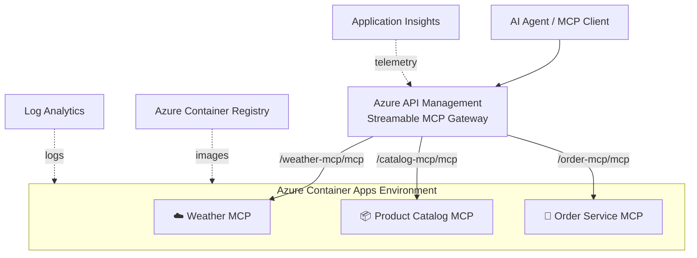
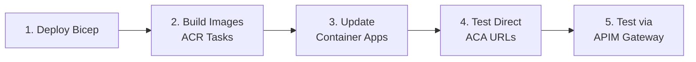

# 🐳 MCP Containers Demo

Deploy **Python [FastMCP](https://github.com/jlowin/fastmcp) servers** as containers in **Azure Container Apps (ACA)**, fronted by **Azure API Management** as a unified streamable MCP gateway.

## Architecture



## MCP Servers

| Server | Container | Tools | Description |
|--------|-----------|-------|-------------|
| ☁️ **Weather** | `weather-mcp` | `get_cities`, `get_weather` | Returns cities by country and simulated weather data |
| 📦 **Product Catalog** | `catalog-mcp` | `search_products`, `get_product`, `list_categories`, `check_stock` | In-memory product catalog with 8 products |
| 🛒 **Order Service** | `order-mcp` | `place_order`, `get_order`, `list_orders` | Order placement with product validation |

## Project Structure

```
labs/mcp-from-api/
├── demo-mcp-containers.bicep       # Bicep orchestration template
├── demo-mcp-containers.ipynb       # Step-by-step demo notebook
└── src/
    ├── weather/container/
    │   ├── mcp_server.py           # FastMCP Weather server
    │   ├── Dockerfile
    │   └── requirements.txt
    ├── product-catalog/container/
    │   ├── mcp_server.py           # FastMCP Product Catalog server
    │   ├── Dockerfile
    │   └── requirements.txt
    └── place-order/container/
        ├── mcp_server.py           # FastMCP Order Service server
        ├── Dockerfile
        └── requirements.txt

modules/container-apps/v1/
├── environment.bicep               # ACA Environment + ACR module
└── container-app.bicep             # Single container app module
```

## How It Works

### FastMCP Server Pattern

Each MCP server follows the same pattern using [FastMCP](https://github.com/jlowin/fastmcp):

```python
from fastmcp import FastMCP
from starlette.applications import Starlette
from starlette.routing import Mount

mcp = FastMCP("ServerName")

@mcp.tool()
async def my_tool(ctx, param: str) -> str:
    """Tool description."""
    return "result"

# Mount at a sub-path for Streamable HTTP
mcp_asgi = mcp.http_app()
app = Starlette(
    routes=[Mount("/path", app=mcp_asgi)],
    lifespan=mcp_asgi.lifespan,
)
```

### Container Image

All servers use the same Dockerfile pattern:

- **Base**: `python:3.13.2-slim`
- **Framework**: FastMCP 2.12.4 + uvicorn
- **Port**: 8080
- **Transport**: Streamable HTTP (MCP standard)

### APIM Integration

Azure API Management proxies each container app as a **streamable MCP API**, providing:

- **Unified gateway** — single endpoint for all MCP servers
- **Subscription key management** — built-in auth
- **Logging & analytics** — Application Insights integration
- **Rate limiting / policies** — enterprise controls

## Deployment Flow



1. **Deploy infrastructure** — Bicep creates APIM, ACR, ACA Environment, Container Apps, and APIM MCP APIs
2. **Build images** — `az acr build` compiles each Dockerfile directly in the cloud (no local Docker needed)
3. **Update containers** — `az containerapp update` sets the freshly-built images
4. **Test direct** — connect to ACA container URLs using MCP Python client
5. **Test via APIM** — connect through the APIM gateway to verify end-to-end proxying

## Quick Start

Open [demo-mcp-containers.ipynb](demo-mcp-containers.ipynb) and run all cells.

### Prerequisites

- Python 3.12+
- Azure CLI (signed in)
- Azure Subscription with Contributor + RBAC Administrator roles
- VS Code with Jupyter extension

## Resources Deployed

| Resource | SKU/Tier | Purpose |
|----------|----------|---------|
| Log Analytics Workspace | Pay-as-you-go | Central logging |
| Application Insights | — | Monitoring |
| API Management | Basicv2 | MCP gateway |
| API Center | Free | API catalog |
| Container Registry | Basic | Image store |
| Container Apps Environment | Consumption | Serverless containers |
| 3× Container Apps | 0.25 vCPU / 0.5 GB | MCP servers |
