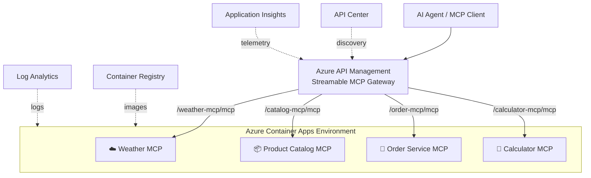
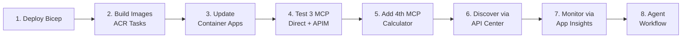

# 🐳 MCP Containers Demo

Deploy **Python [FastMCP](https://github.com/jlowin/fastmcp) servers** as containers in **Azure Container Apps (ACA)**, proxied through **Azure API Management**, registered in **Azure API Center** for discoverability, and monitored via **Application Insights**.

## Architecture



## MCP Servers

| Server | Container | Tools | Description |
|--------|-----------|-------|-------------|
| ☁️ **Weather** | `weather-mcp` | `get_cities`, `get_weather` | Returns cities by country and simulated weather data |
| 📦 **Product Catalog** | `catalog-mcp` | `search_products`, `get_product`, `list_categories`, `check_stock` | In-memory product catalog with 8 products |
| 🛒 **Order Service** | `order-mcp` | `place_order`, `get_order`, `list_orders` | Order placement with product validation |
| 🧮 **Calculator** | `calculator-mcp` | `calculate`, `sqrt`, `convert_units` | Math operations, square roots, and unit conversions |

## What You'll Learn

| Part | Topic | Key Concepts |
|------|-------|-------------|
| 1 | **Deploy Infrastructure** | Bicep IaC, APIM, ACA, ACR, API Center, App Insights |
| 2 | **Build & Deploy Containers** | ACR Tasks (cloud builds), container app updates |
| 3 | **Test 3 MCP Servers** | Direct ACA access, APIM gateway proxy, MCP client |
| 4 | **Add 4th MCP (Scale-Out)** | Incremental container deployment, Calculator MCP |
| 5 | **API Center Discovery** | Browse catalog, filter by `kind: mcp`, dynamic connection |
| 6 | **Monitoring & Security** | App Insights diagnostics, W3C tracing, request analytics |
| 7 | **Agent Workflow** | Multi-tool chaining across 4 MCP servers, discover → act |
| 8 | **Clean Up** | Resource group deletion |

## Project Structure

```
labs/mcp-from-api/
├── demo-mcp-containers.bicep       # Bicep orchestration template
├── demo-mcp-containers.ipynb       # Step-by-step demo notebook (38 cells)
└── src/
    ├── weather/container/
    │   ├── mcp_server.py           # FastMCP Weather server
    │   ├── Dockerfile
    │   └── requirements.txt
    ├── product-catalog/container/
    │   ├── mcp_server.py           # FastMCP Product Catalog server
    │   ├── Dockerfile
    │   └── requirements.txt
    ├── place-order/container/
    │   ├── mcp_server.py           # FastMCP Order Service server
    │   ├── Dockerfile
    │   └── requirements.txt
    └── calculator/container/
        ├── mcp_server.py           # FastMCP Calculator server
        ├── Dockerfile
        └── requirements.txt

modules/container-apps/v1/
├── environment.bicep               # ACA Environment + ACR module
└── container-app.bicep             # Single container app module
```

## How It Works

### FastMCP Server Pattern

Each MCP server follows the same pattern using [FastMCP](https://github.com/jlowin/fastmcp):

```python
from fastmcp import FastMCP
from starlette.applications import Starlette
from starlette.routing import Mount

mcp = FastMCP("ServerName")

@mcp.tool()
async def my_tool(ctx, param: str) -> str:
    """Tool description."""
    return "result"

# Mount at a sub-path for Streamable HTTP
mcp_asgi = mcp.http_app()
app = Starlette(
    routes=[Mount("/path", app=mcp_asgi)],
    lifespan=mcp_asgi.lifespan,
)
```

### Container Image

All servers use the same Dockerfile pattern:

- **Base**: `python:3.13.2-slim`
- **Framework**: FastMCP 2.12.4 + uvicorn
- **Port**: 8080
- **Transport**: Streamable HTTP (MCP standard)

### APIM Integration

Azure API Management proxies each container app as a **streamable MCP API**, providing:

- **Unified gateway** — single endpoint for all MCP servers
- **Subscription key management** — built-in auth
- **Application Insights diagnostics** — verbose W3C tracing, 100% sampling
- **Rate limiting / policies** — enterprise controls

### API Center Discoverability

Every MCP server is registered in **Azure API Center** with the full hierarchy:

- **API entry** (`kind: mcp`) with title, description, and VS Code install link
- **Version** (1.0.0) with lifecycle stage
- **Definition** and **Deployment** with `runtimeUri` pointing to the APIM gateway

This allows AI agents and developers to **discover MCP servers programmatically** by querying API Center for `kind: mcp` APIs.

### Monitoring & Observability

- **Application Insights diagnostics** on every MCP API with verbose logging
- **W3C distributed tracing** for end-to-end request correlation
- **MCP Insights Dashboard** deployed to Azure Portal
- **Log Analytics** for container app logs and metrics

## Deployment Flow



1. **Deploy infrastructure** — Bicep creates APIM, ACR, ACA Environment, 4 Container Apps, APIM MCP APIs, API Center registrations, diagnostics, and dashboard
2. **Build images** — `az acr build` compiles each Dockerfile directly in the cloud (no local Docker needed)
3. **Update containers** — `az containerapp update` sets the freshly-built images
4. **Test first 3** — connect to Weather, Catalog, Order MCPs (direct ACA + APIM)
5. **Add Calculator** — build & deploy the 4th MCP, demonstrating scale-out
6. **Discover via API Center** — query for `kind: mcp` APIs, get runtime URIs, connect dynamically
7. **Monitor via App Insights** — generate traffic, query telemetry, view request analytics
8. **Agent workflow** — chain tools across all 4 MCP servers in an end-to-end scenario

## Quick Start

Open [demo-mcp-containers.ipynb](demo-mcp-containers.ipynb) and run all cells.

### Prerequisites

- Python 3.12+
- Azure CLI (signed in)
- Azure Subscription with Contributor + RBAC Administrator roles
- VS Code with Jupyter extension

## Resources Deployed

| Resource | SKU/Tier | Purpose |
|----------|----------|---------|
| Log Analytics Workspace | Pay-as-you-go | Central logging |
| Application Insights | — | Monitoring & tracing |
| API Management | Basicv2 | MCP gateway |
| API Center | Free | MCP discovery catalog |
| Container Registry | Basic | Image store |
| Container Apps Environment | Consumption | Serverless containers |
| 4× Container Apps | 0.25 vCPU / 0.5 GB | MCP servers |
| 4× App Insights Diagnostics | — | Verbose tracing per API |
| 4× API Center Registrations | — | MCP discoverability |
| MCP Insights Dashboard | — | Azure Portal monitoring |
